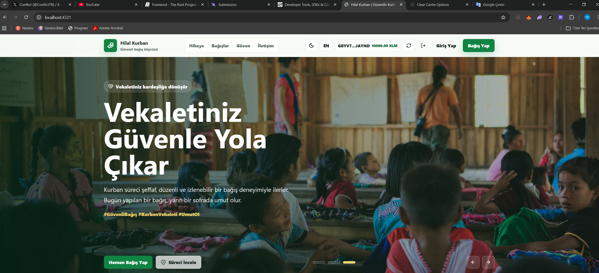
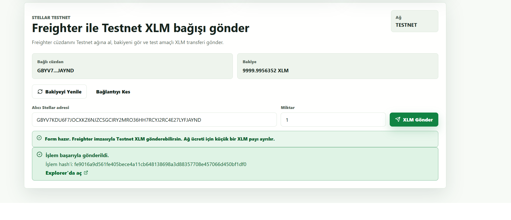
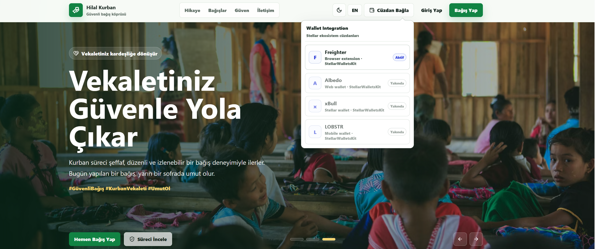

# Warning

This project was developed with the help of artificial intelligence. It was automatically generated using publicly available sources.

# Donation Page

Astro, Svelte and TypeScript ile hazırlanmış responsive kurban bağışı frontend'i.

## Özellikler

- Yeşil kurumsal bağış teması
- Responsive navbar ve mobil menü
- Dark mode
- TR/EN dil geçişi
- Duygusal hikaye anlatımlı hero slider
- Kurban, adak, akika ve şükür bağış kartları
- Gelecek backend ve Web3 contract entegrasyonu için adapter yapısı

## Komutlar

```bash
npm install
npm run dev
npm run build
```

## Screenshots

### Home Page



### Stellar Testnet Transfer



### Wallet Picker


